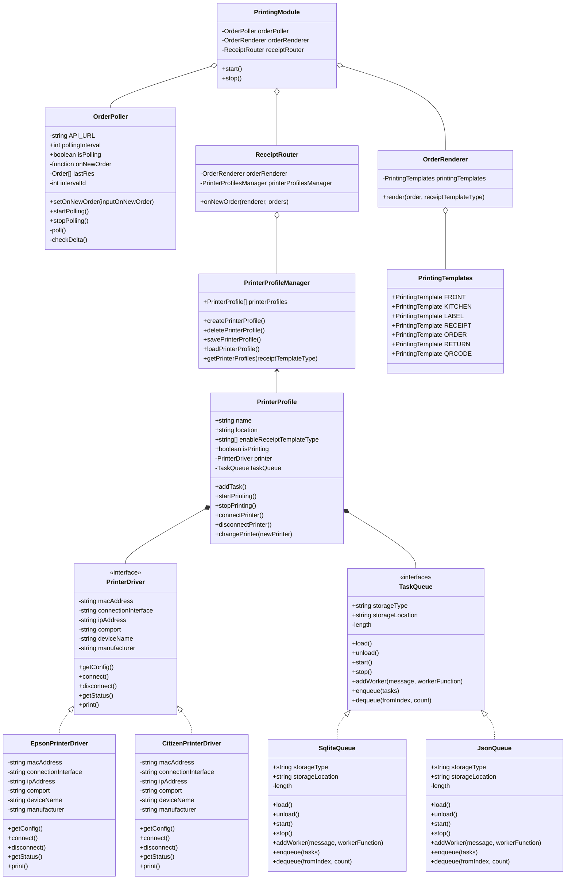

# App Architecture Class Diagram

```mermaid
classDiagram

    PrintingModule o-- OrderPoller
    PrintingModule o-- OrderRenderer
    PrintingModule o-- ReceiptRouter
    ReceiptRouter o-- PrinterProfileManager
    OrderRenderer o-- PrintingTemplates
    TaskQueue <|.. SqliteQueue
    TaskQueue <|.. JsonQueue
    PrinterProfile *-- PrinterDriver
    PrinterProfile *-- TaskQueue
    PrinterProfileManager <-- PrinterProfile
    PrinterDriver <|.. EpsonPrinterDriver
    PrinterDriver <|.. CitizenPrinterDriver

    class PrintingModule{
        -OrderPoller orderPoller
        -OrderRenderer orderRenderer
        -ReceiptRouter receiptRouter

        +start()
        +stop()
    }

    class OrderPoller{
        -string API_URL
        +int pollingInterval
        +boolean isPolling
        -function onNewOrder
        -Order[] lastRes
        -int intervalId

        +setOnNewOrder(inputOnNewOrder)
        +startPolling()
        +stopPolling()
        -poll()
        -checkDelta()
    }
    class ReceiptRouter{
        -OrderRenderer orderRenderer
        -PrinterProfilesManager printerProfilesManager

        +onNewOrder(renderer, orders)
    }
    class OrderRenderer{
        -PrintingTemplates printingTemplates

        +render(order, receiptTemplateType)
    }
    class PrintingTemplates{
        +PrintingTemplate FRONT
        +PrintingTemplate KITCHEN
        +PrintingTemplate LABEL
        +PrintingTemplate RECEIPT
        +PrintingTemplate ORDER
        +PrintingTemplate RETURN
        +PrintingTemplate QRCODE
    }
    class PrinterProfileManager{
        +PrinterProfile[] printerProfiles

        +createPrinterProfile()
        +deletePrinterProfile()
        +savePrinterProfile()
        +loadPrinterProfile()
        +getPrinterProfiles(receiptTemplateType)
    }
    class PrinterProfile{
        +string name
        +string location
        +string[] enableReceiptTemplateType
        +boolean isPrinting
        -PrinterDriver printer
        -TaskQueue taskQueue

        +addTask()
        +startPrinting()
        +stopPrinting()
        +connectPrinter()
        +disconnectPrinter()
        +changePrinter(newPrinter)
    }
    class TaskQueue{
        <<interface>>
        +string storageType
        +string storageLocation
        -length

        +load()
        +unload()
        +start()
        +stop()
        +addWorker(message, workerFunction)
        +enqueue(tasks)
        +dequeue(fromIndex, count)
    }
    class SqliteQueue{
        +string storageType
        +string storageLocation
        -length

        +load()
        +unload()
        +start()
        +stop()
        +addWorker(message, workerFunction)
        +enqueue(tasks)
        +dequeue(fromIndex, count)
    }
    class JsonQueue{
        +string storageType
        +string storageLocation
        -length

        +load()
        +unload()
        +start()
        +stop()
        +addWorker(message, workerFunction)
        +enqueue(tasks)
        +dequeue(fromIndex, count)
    }
    class PrinterDriver{
        <<interface>>
        -string macAddress
        -string connectionInterface
        -string ipAddress
        -string comport
        -string deviceName
        -string manufacturer

        +getConfig()
        +connect()
        +disconnect()
        +getStatus()
        +print()
    }
    class EpsonPrinterDriver{
        -string macAddress
        -string connectionInterface
        -string ipAddress
        -string comport
        -string deviceName
        -string manufacturer

        +getConfig()
        +connect()
        +disconnect()
        +getStatus()
        +print()
    }
    class CitizenPrinterDriver{
        -string macAddress
        -string connectionInterface
        -string ipAddress
        -string comport
        -string deviceName
        -string manufacturer

        +getConfig()
        +connect()
        +disconnect()
        +getStatus()
        +print()
    }
```

This diagram visualizes the modular architecture of the app, showing the flow from polling orders to printing.
